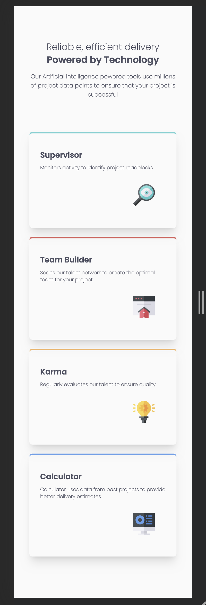
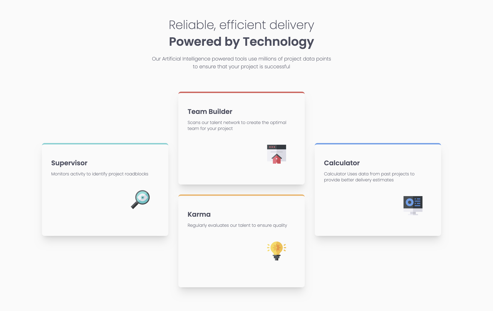

# Frontend Mentor - Four card feature section solution

This is a solution to the [Four card feature section challenge on Frontend Mentor](https://www.frontendmentor.io/challenges/four-card-feature-section-weK1eFYK). Frontend Mentor challenges help you improve your coding skills by building realistic projects.

## Table of contents

- [Overview](#overview)
  - [The challenge](#the-challenge)
  - [Screenshot](#screenshot)
  - [Links](#links)
- [My process](#my-process)
  - [Built with](#built-with)
  - [What I learned](#what-i-learned)
  - [Continued development](#continued-development)
  - [Useful resources](#useful-resources)
- [Author](#author)
- [Acknowledgments](#acknowledgments)

## Overview

### The challenge

Users should be able to:

- View the optimal layout for the site depending on their device's screen size

### Screenshot




### Links

- [Check out the code here: ](https://github.com/John-Davidson-8/fem-four-card-feature)
- [Check out the live site](https://fem-four-card-feature-main.netlify.app/)

## My process

I began mobile first using using CSS Grid and a one column layout which widened to a three column grid for the desktop view. I had to add six rows in order to accommodate the position of the cards.

### Built with

- Semantic HTML5 markup
- CSS custom properties
- CSS Grid

### What I learned

I spent three days reading and learning about CSS Grid before I began this project. The biggest learning curve was positioning cards in various positions for the desktop view. I also paid more attention to the mockup and attempted to get each element in the correct position and the correct size with as clean and minimal code as possible. CSS Grid and media queries were the most beneficial learning from this project. I also completed the project in a day, these newbie projects used to take me up to a week to complete! So happy with my progress. Below are sections of code which helped me gain a basic understanding of CSS Grid.

First is the first card within the section:

```html
<section class="cards">
  <div class="card card-aqua">
    <h2>Supervisor</h2>
    <p>Monitors activity to identify project roadblocks</p>
    
  </div>
</section>
```

Secondly, is the CSS for the media query expanding at 36rem:

```css
@media (min-width: 36rem) {
  section {
    display: grid;
    grid-template-columns: 1fr 1fr 1fr;
    grid-template-rows: 7.813rem 7.813rem 7.813rem 7.813rem 7.813rem;
    gap: 1.875rem;
  }
}
```

### Continued development

This is only my second adventure into the world of CSS Grid. I think it paid off to do a couple of days of reading and tutorials to gain a theoretical image in my mind as how it works. Moving forward I will continue to gain more as the challenges become more complex.

### Useful resources

- [Check out Shruti Balasa's book on CSS Flex and Grid](https://shrutibalasa.gumroad.com/l/css-flex-and-grid) - one of the most valuable resources on this for less than £20. She has fantastic exercises and explains concepts clearly.
- [John Smilga's full HTML and CSS Udemy course](https://www.udemy.com/course/in-depth-html-css-course-build-responsive-websites/) - A comprehensive course I come back to time and time again.

## Author

- Website - [John Davidson](https://www.upwork.com/en-gb/freelancers/~018613765e268de80b)
- Frontend Mentor - [@John-Davidson-8](https://www.frontendmentor.io/profile/John-Davidson-8)
- Twitter - [@jodo828](https://twitter.com/jodo828)

## Acknowledgments

Thanks once again to Alex in the Frontend Mentor community for answering my questions.
